---
3. Quick Start
---

Welcome to Treeify, your AI test design assistant.

Treeify helps you complete test design in a smarter, more structured way. Instead of producing a scattered one-shot output, it moves step by step from requirement understanding to test object decomposition and then to test scenario generation. This chapter walks you through the full onboarding flow, from signing up and creating a Project to generating and refining your first batch of test design results.

## 3.1 Before You Start

For a smoother experience, we recommend confirming the following first:

- **Browser**: The latest version of Chrome, Firefox, or Edge
- **Network**: A stable connection for uploads, generation, and real-time interaction
- **Account**: A Treeify account, either personal or enterprise

## 3.2 Early Access

During the current testing phase, we are opening early access to users who are willing to participate in beta testing and share feedback. Once accepted, you can typically receive:

- **100 Credits** upon signup
- Full access to the test design generation experience
- A higher-priority feedback channel, with a chance to influence future product iterations

## 3.3 Sign Up and Log In

### Sign Up

1. Open the Treeify sign-up page.
2. Fill in your account information and submit the form.
3. After registration, you can apply to join the beta program.
4. Once approved, you will receive **100 Credits** per month for beta use, with no credit card required.

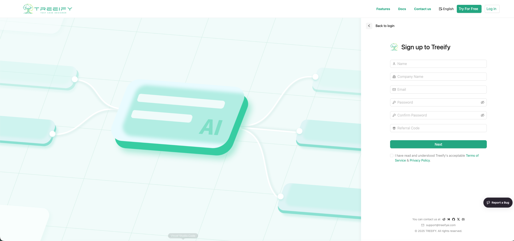

### Log In

1. Open the login page.
2. Enter your account details and click **Login**.
3. After logging in successfully, you will enter the **Dashboard**.

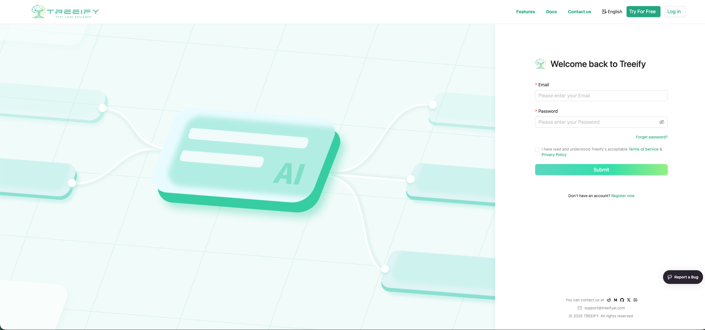

## 3.4 Dashboard: Where Your Test Design Work Begins

After logging in, you will arrive at Treeify's **Dashboard**. This is the central entry point for managing your test design work, including:

- Project management
- Requirement input
- Generated result history
- Export and follow-up actions

You can think of the Dashboard as Treeify's workbench: it is where you start a new test design task and where you continue advancing existing projects.

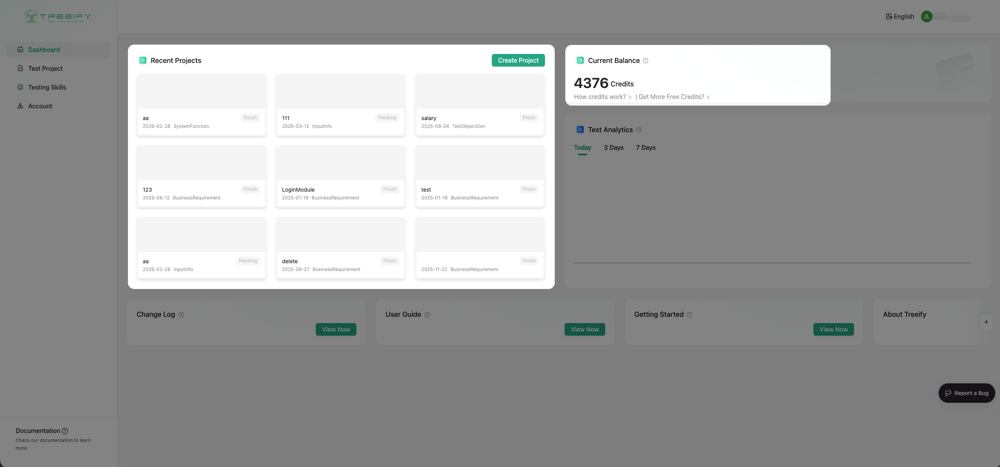

## 3.5 Create Your First Project

In the Dashboard, click **New Project** to create a project.

During creation, you will need to enter the project name and other basic information. Once created, the project will appear in the project list so you can return to it and keep iterating.

In Treeify, a **Project is more than just a folder**. It stores the requirement input, generated results, and follow-up adjustments related to the current test design effort, so you can keep progressing around one real requirement instead of starting over every time.

We recommend creating Projects around a real business module, feature requirement, or release task. This makes later management easier and also helps AI understand your requirements in a clearer context.

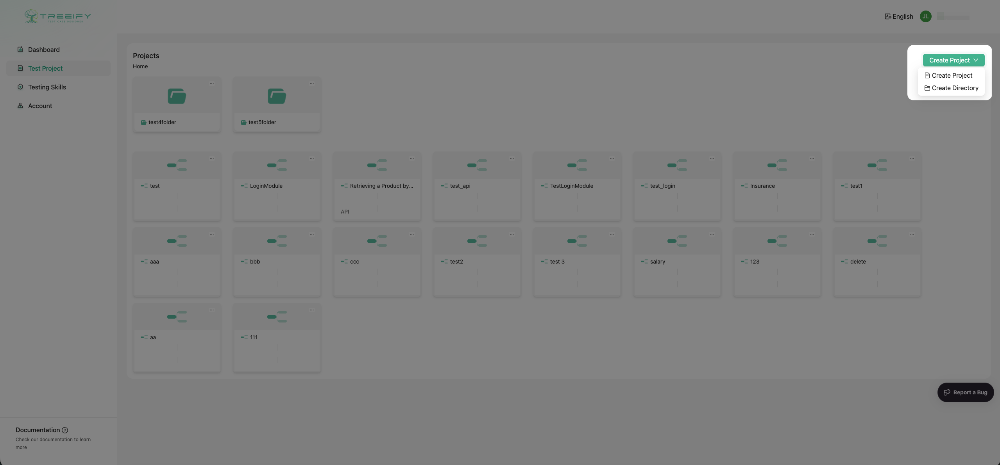

## 3.6 Enter Requirement Information

Once you enter a Project, you can start providing requirements.

Treeify supports both direct text input and document upload. Depending on how you work, you can hand over your existing requirement materials in the way that is most convenient for Treeify to understand and analyze.

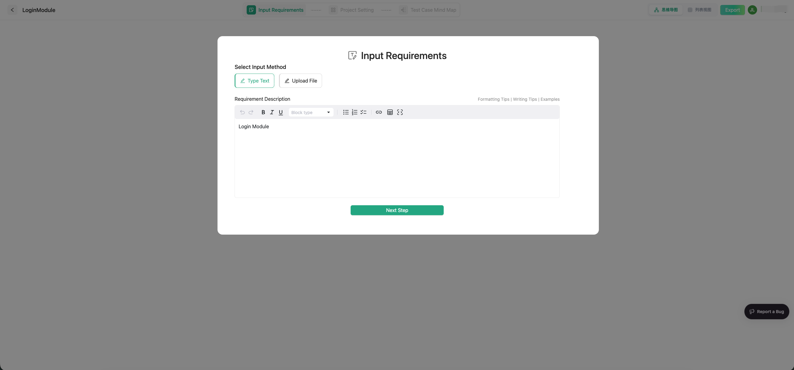
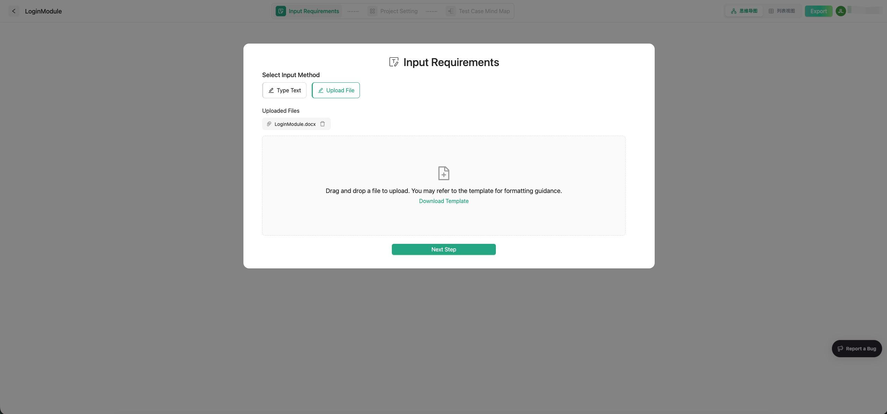

The currently supported document formats include:

- `pdf`
- `xmind`
- `md`
- `txt`
- `csv`
- `xls`
- `xlsx`
- `vsd`
- `vsdx`
- `doc`
- `docx`

In addition to plain text, Treeify also supports **multimodal parsing** for images embedded in documents. That means if your requirement materials contain flowcharts, structural diagrams, page sketches, table screenshots, or other important visuals, Treeify will not just read the text. It will also interpret the images together with the text to reconstruct the requirement meaning and business context more completely.

You can provide requirements in several ways:

- Upload PRDs, design documents, flowcharts, and similar files
- Paste structured text, user stories, or feature descriptions
- Enter content directly in the built-in editor

These inputs become the foundation for later requirement analysis, test object generation, and test scenario generation.

To make the results more stable, we recommend prioritizing the following information:

- Functional goals or business background
- Key flows and core rules
- Important inputs and outputs
- Constraints that affect decision-making
- Supporting materials strongly related to the current requirement

If your requirements come from multiple sources, try to organize them around one topic whenever possible. Avoid mixing in too much unrelated information at once, or the AI may lose focus.

## 3.7 Project Settings

Before generating results, you can configure project parameters based on your testing goals so the output better matches real needs.

The configurable options typically include:

- **Testing Type**: such as functional, performance, security, compatibility, API, and more
- **Industry Context**: such as finance or healthcare, to help AI better understand the domain background
- **Generation Strategy**: `Strict` emphasizes focus and precision, while `Complement` emphasizes broader coverage

These settings influence Treeify's later analysis and generation direction, and you can adjust them flexibly based on the task at hand.

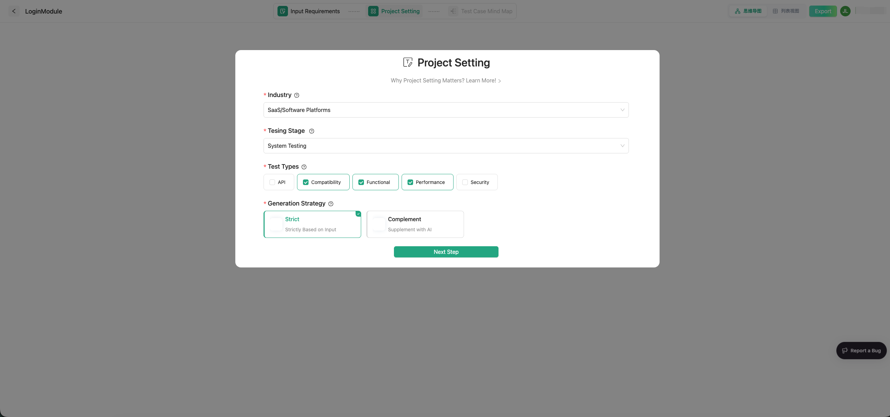

## 3.8 TestSpace: Your AI Test Design Space

Once the requirement information is ready, you can enter Treeify's core workspace: **TestSpace**.

You can think of TestSpace as an **AI test design space** centered on real testing work. Here, Treeify does more than generate results. It helps you complete the entire test design process around generation, review, editing, conversational refinement, and capability accumulation.

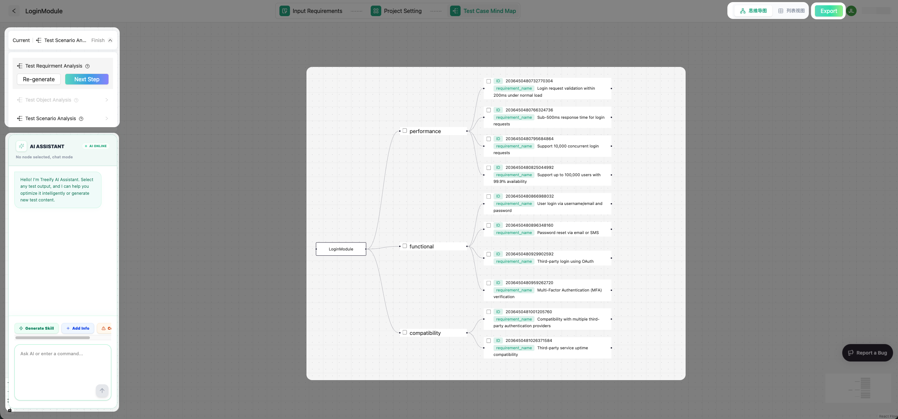

### 3.8.1 Start Generating Test Design

Treeify uses a structured **three-stage test design workflow**:

1. **Requirement Analysis**  
   Extract system behaviors, business rules, and key constraints from the input to build a clearer foundation for understanding the requirement.

2. **Test Object Analysis**  
   Break the requirement down into objects that are more suitable for test design, such as functional modules, flow nodes, data-processing units, or user paths.

3. **Test Scenario Generation**  
   Generate fuller test scenarios based on the test objects, helping you systematically cover core flows, edge cases, and exception paths.

The value of this approach is that Treeify does not simply output a scattered list of test points. It helps you complete test design gradually through a clearer process.

### 3.8.2 Two Result Views: Table and Mind Map

After generation is complete, you can review the results in two different views:

- **Table View**: best for browsing, filtering, and managing content in bulk
- **Mind Map View**: best for understanding the structure and hierarchy of the design

These are two different presentations of the same generated result. You can choose whichever view suits your current task: the table is more efficient when you need to scan large amounts of content or perform bulk actions, while the mind map is more intuitive when you need to understand structure, decomposition logic, and coverage relationships.

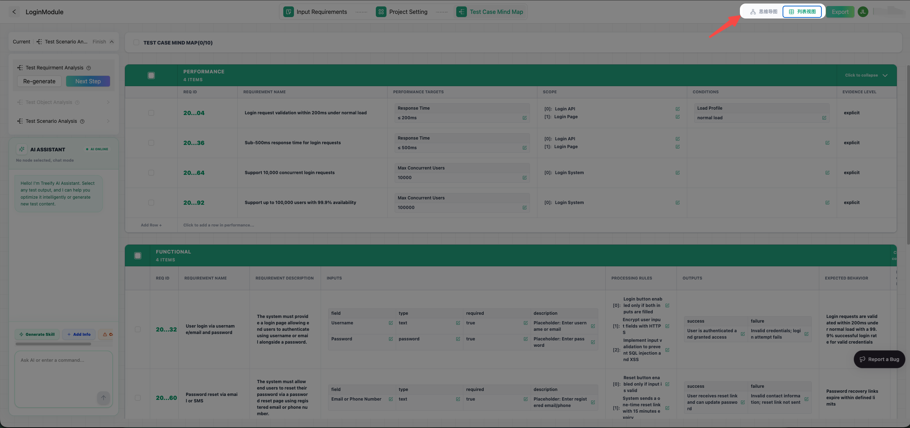

### 3.8.3 Bulk Actions and Centralized Refinement

Treeify does not just let you inspect results. It also supports follow-up operations and optimization around generated content.

For generated results, you can perform bulk actions such as:

- **Bulk delete**
- **Bulk conversational edits**

This means you do not have to handle every single item one by one. You can adjust a group of results together, which significantly improves iteration efficiency. That is especially important when working with large-scale test design content in real projects.

### 3.8.4 The Left Chat Panel: Chat Mode and Agent Mode

On the left side of TestSpace, you will see Treeify's chat panel. It provides two modes and automatically switches based on whether you have selected generated content.

#### Chat Mode

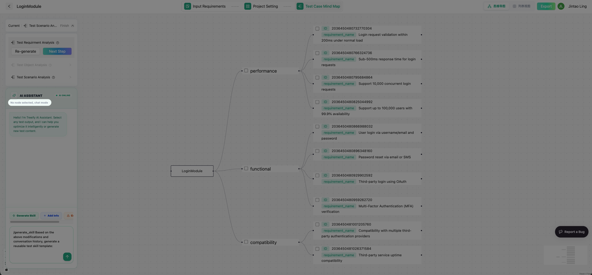

When **no generated content is selected**, the panel is in **Chat Mode**.

In this mode, you can treat it like a general AI assistant, similar to using ChatGPT for free-form conversation. For example, you can:

- Look up background information
- Ask about testing-related knowledge
- Use it to understand a requirement
- Let it help organize your thinking or supplement context

Chat Mode is a better fit for information gathering, exploration, and clarification before you formally revise generated results.

#### Agent Mode

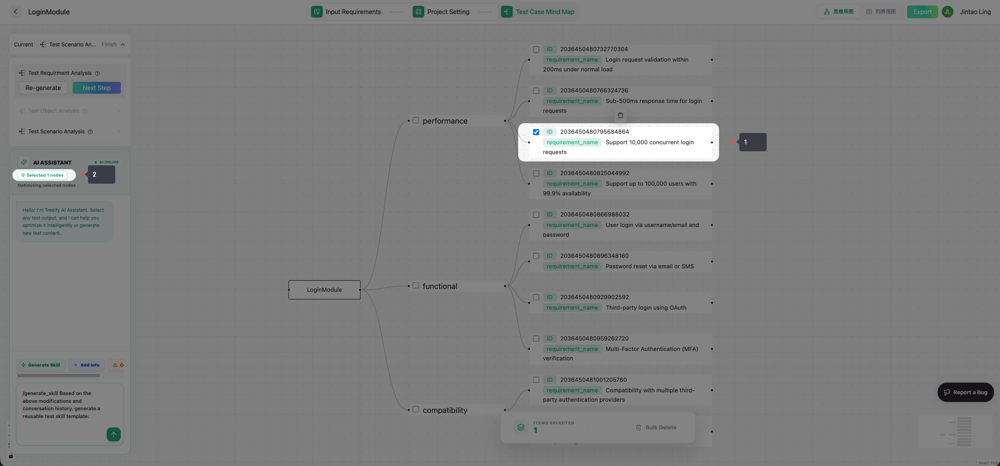

When you **select specific content in the table or mind map**, the panel switches into **Agent Mode**.

In this mode, Treeify optimizes the selected content directly instead of giving broad, generic suggestions. You can ask it to:

- Improve the selected test design content
- Add missing edge cases or exception paths
- Adjust the wording, structure, or coverage scope
- Make more focused changes based on the selected result

That makes the conversation more than "ask a big question and get a big answer." It becomes a way to perform edits around the work you are doing right now.

### 3.8.5 Turning Edits into Skills

In Agent Mode, Treeify is not only helping you revise the current content.

As repeated improvements begin to reflect stable methods, preferences, and professional judgment, those edits can be summarized into **Skills**. In other words, Treeify does not just make one-off content adjustments. It also helps you gradually distill expert experience into capabilities that AI can continue consuming and reusing.

From that perspective, every high-quality revision is more than a simple editing action. It can also become a professional asset that is reusable, composable, and capable of creating value over time.

## 3.9 Export Results

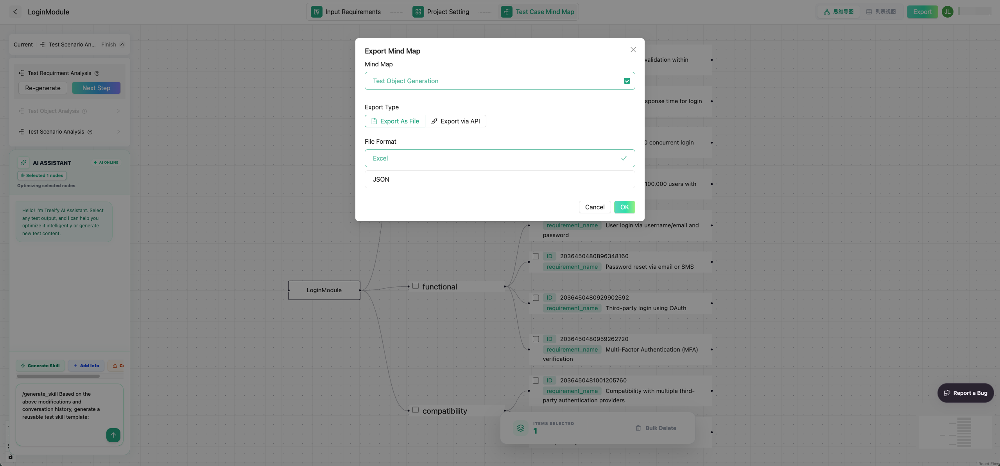

Once the results are in a usable state, you can export them for later execution, review, or team collaboration.

Treeify supports exporting results into your actual workflow so that test design becomes part of your day-to-day QA process instead of stopping at the generation stage.

## 3.10 A Recommended Way to Start

If you are using Treeify for the first time, we recommend starting in this order:

1. Create a Project around one clear requirement.
2. Enter the core requirement description or upload the most important document.
3. Complete the first round of test design generation.
4. Review the results in Table View or Mind Map View.
5. Use Chat Mode first to gather supporting information or clarify open questions.
6. Then select specific content and use Agent Mode for refinement.
7. Turn high-value revisions into Skills.
8. Export the results into your downstream workflow.

For your first use, do not aim for perfection in one pass. A better approach is to run through the full process once, then gradually add more complexity and professional requirements from real projects.

## 3.11 Keep Exploring

For a fuller explanation, continue to the following chapters to learn more about:

- How Projects organize context
- Treeify's three-stage test design workflow
- How Skills improve generation quality
- How better input leads to more accurate results
- How to continuously optimize and reuse test design results in real projects

Once you have completed your first generation, you are already using Treeify for real. From there, you can keep iterating around actual projects and let Treeify go deeper into your test design workflow.
