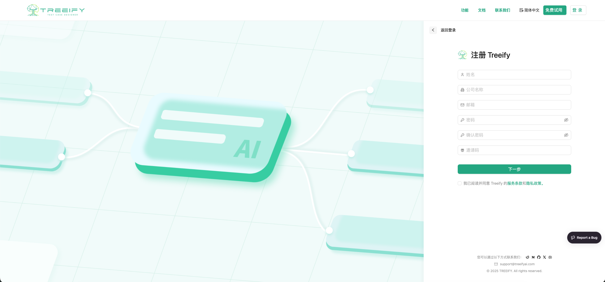
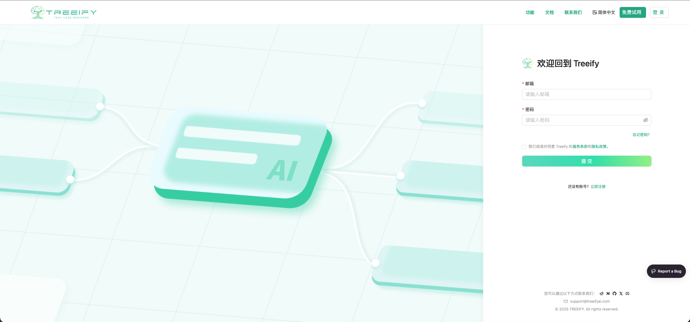
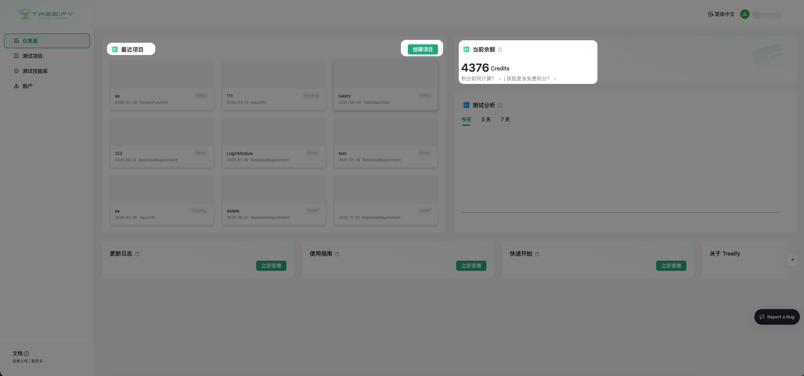
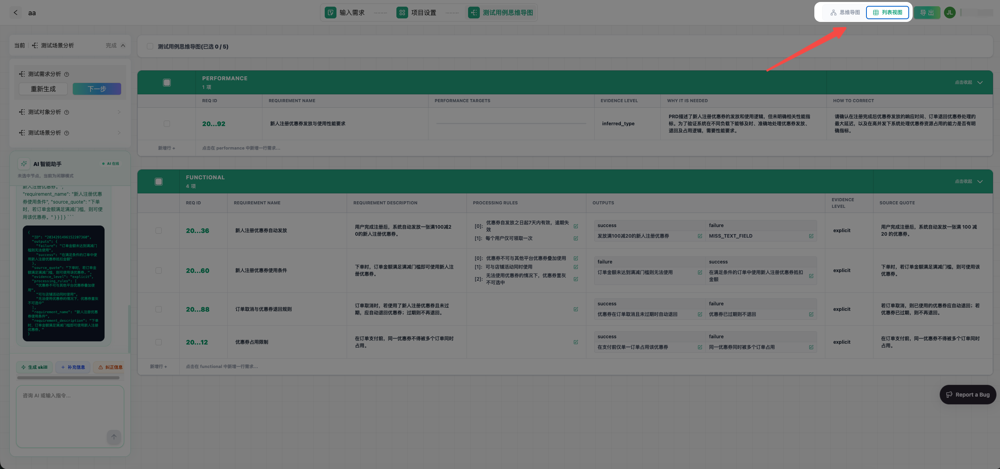
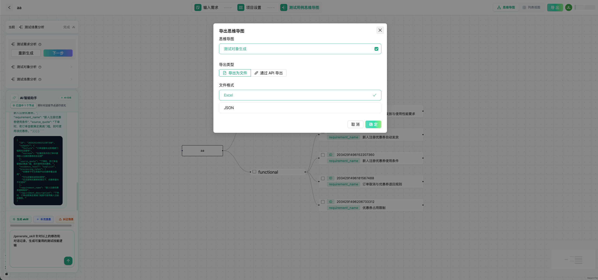

---
3. 快速开始
---

欢迎使用 Treeify —— 你的 AI 测试设计助手。

Treeify 帮助你以更智能、更结构化的方式完成测试设计，从需求理解、测试对象拆解到测试场景生成，逐步推进，而不是一次性输出零散结果。本章节将带你快速完成从注册、创建 Project，到生成并优化第一批测试设计结果的完整上手流程。

## 3.1 开始之前

为了获得更流畅的使用体验，建议你先确认以下条件：

- **浏览器**：Chrome、Firefox、Edge 最新版本
- **网络环境**：建议使用稳定网络，以保证上传、生成和实时交互顺畅
- **账号**：Treeify 账号（个人账号或企业账号）

## 3.2 抢先体验

在当前测试阶段，我们会向愿意参与内测并提供反馈的用户开放抢先体验资格。成功加入后，通常可以获得：

- 注册即得 **100 Credits** 的体验额度
- 完整的测试设计生成功能体验权限
- 更高优先级的反馈通道，并有机会影响产品后续迭代方向

## 3.3 注册与登录

### 注册

1. 打开 Treeify 注册页面
2. 填写账号信息并提交
3. 完成注册后，你可以申请加入内测计划
4. 通过后即可获得每月 **100 Credits** 的内测额度，无需绑定信用卡

### 登录

1. 打开登录页面
2. 输入你的账号信息并点击 **Login**
3. 登录成功后，你将进入 **Dashboard**

## 3.4 Dashboard：开始你的测试设计工作

登录后，你会进入 Treeify 的 **Dashboard**。这里是你管理测试设计工作的统一入口，包括：

- Project 管理
- 需求输入
- 生成记录查看
- 结果导出与后续操作

你可以把 Dashboard 理解为 Treeify 的工作台：从这里开始一个新的测试设计任务，也从这里继续推进已有项目。

## 3.5 创建你的第一个 Project

在 Dashboard 中，点击 **New Project** 创建项目。

创建时，你需要填写项目名称及相关基础信息。创建成功后，项目会出现在项目列表中，方便后续继续进入和迭代。

在 Treeify 中，**Project 不只是一个文件夹**。它会保存与你这次测试设计相关的需求输入、生成结果和后续调整内容，帮助你围绕同一个真实需求持续推进，而不是每次都从零开始。

建议你按实际业务模块、功能需求或版本任务来创建 Project，这样更方便后续管理，也能让 AI 在更清晰的上下文中理解你的需求。

## 3.6 输入需求信息

## 3.6 输入需求信息

进入 Project 后，你可以开始输入需求。

Treeify 支持直接输入文本，也支持上传文档。你可以根据自己的工作方式，把已有需求材料以更方便的方式交给 Treeify 理解和分析。

当前支持的文档格式包括：

- `pdf`
- `xmind`
- `md`
- `txt`
- `csv`
- `xls`
- `xlsx`
- `vsd`
- `vsdx`
- `doc`
- `docx`

除了文本内容本身，Treeify 还支持对文档中的图片进行 **多模态解析**。这意味着，当你的需求资料中包含流程图、结构图、页面草图、表格截图或其他关键信息图片时，Treeify 不只是读取文字，也会结合图片内容一起理解文档，从而更完整地还原需求语义和业务上下文。

你可以通过以下方式输入需求：

- 上传 PRD、设计文档、流程图等文件
- 粘贴结构化文本、用户故事或功能说明
- 使用内置编辑器直接输入内容

这些输入将成为后续需求分析、测试对象生成和测试场景生成的基础。

为了让结果更稳定，建议优先提供以下信息：

- 功能目标或业务背景
- 关键流程与核心规则
- 重要输入输出
- 影响判断的约束条件
- 与当前需求强相关的补充材料

如果你的需求来自多个来源，建议尽量围绕同一个主题组织信息，避免一次性混入过多不相关内容，影响 AI 的判断重点。

## 3.7 项目设置

在开始生成前，你可以根据测试目标配置项目参数，让结果更贴合实际需要。

当前可配置内容通常包括：

- **测试类型**：如功能、性能、安全、兼容性、API 等
- **行业语境**：如金融、医疗等，用于帮助 AI 更好理解领域背景
- **生成策略**：`严格`强调结果聚焦度；`补全`更强调覆盖完整性，

这些设置会影响 Treeify 后续的分析和生成方向。你可以根据当前任务灵活调整。

## 3.8 TestSpace：你的 AI 测试设计空间

当需求信息准备好后，你就可以进入 Treeify 的核心工作区——**TestSpace**。

你可以把 TestSpace 理解为一个围绕真实测试设计任务展开的 **AI 测试设计空间**。在这里，Treeify 不只是帮你生成结果，而是让你围绕生成、查看、修改、对话优化和能力沉淀，完成整个测试设计过程。

### 3.8.1 开始生成测试设计

Treeify 采用结构化的 **3 阶段测试设计流程**：

1. **需求分析（Requirement Analysis）**  
   从输入内容中提取系统行为、业务规则和关键约束，帮助建立更清晰的需求理解基础。

2. **测试对象生成（Test Object Analysis）**  
   将需求进一步拆解为更适合测试设计的对象，例如功能模块、流程节点、数据处理单元或用户操作路径。

3. **测试场景生成（Test Scenario Generation）**  
   基于测试对象生成更完整的测试场景，帮助你系统化覆盖核心流程、边界情况和异常路径。

这种方式的好处在于，Treeify 并不是直接生成一批零散测试点，而是帮助你沿着更清晰的过程逐步完成测试设计。

### 3.8.2 两种结果视图：表格与思维导图

生成完成后，你可以通过两种视图查看结果：

- **表格视图**：适合批量浏览、筛选和管理测试设计内容
- **思维导图视图**：适合从结构层面理解测试设计过程与层级关系

这两种视图面向的是同一份生成结果，只是呈现方式不同。你可以根据当前任务选择更适合的视图：当你需要快速查看大量内容、做批量操作时，表格视图会更高效；当你需要理解结构、检查拆解逻辑和覆盖关系时，思维导图视图会更直观。

### 3.8.3 批量操作与集中优化

Treeify 不只是让你查看结果，也支持你围绕生成内容进行进一步操作和优化。

对于生成结果，你可以进行批量操作，例如：

- **批量删除**
- **批量对话修改**

这意味着你不需要只针对单条内容逐个处理，而可以围绕一组结果统一调整，大幅提升迭代效率。对于真实项目中的大规模测试设计内容，这一点尤其重要。

### 3.8.4 左侧对话框：闲聊模式与 Agent 模式

在 TestSpace 左侧，你会看到 Treeify 的对话框。这个对话框提供两种模式，会根据你是否选中了生成内容自动切换工作方式。

#### 闲聊模式

当你**没有选中任何生成内容**时，对话框处于 **闲聊模式**。

在这个模式下，你可以把它理解为一个通用 AI 助手，像使用 ChatGPT 一样进行自由对话。例如你可以：

- 查询背景资料
- 询问测试相关知识
- 让它帮助你理解某段需求
- 让它辅助整理思路或补充上下文

闲聊模式更适合在正式修改结果之前，先做信息查询、思路探索或问题澄清。

#### Agent 模式

当你**选中了表格或思维导图中的具体内容**时，对话框会进入 **Agent 模式**。

在这个模式下，Treeify 会围绕你选中的内容进行定向优化，而不是泛泛地输出建议。你可以让它：

- 优化选中的测试设计内容
- 补充遗漏的边界情况或异常路径
- 调整表达方式、结构或覆盖范围
- 基于选中结果进行更聚焦的修改

这使得对话不再只是“问一个大问题、得到一段大回答”，而是能够真正围绕当前工作内容执行修改任务。

### 3.8.5 从修改中沉淀 Skills

在 Agent 模式下，Treeify 不只是在帮助你修改当前内容。

当一次次优化逐渐体现出稳定的方法、偏好和专业判断时，这些修改还可以进一步被总结为 **Skills**。这意味着，Treeify 不只是完成一次性的内容调整，也在帮助你把专家经验逐步沉淀为 AI 可以继续消费和复用的能力。

从这个角度看，每一次高质量修改都不只是一次编辑动作，也可能成为未来可复用、可组合、可持续发挥价值的专业资产。

## 3.9 导出结果

当结果达到可用状态后，你可以将其导出，用于后续测试执行、评审或团队协作。

Treeify 支持将结果导出到你的实际工作流中，帮助你把测试设计真正接入日常 QA 流程，而不是停留在生成阶段。

## 3.10 建议的第一次使用方式

如果你是第一次使用 Treeify，建议按照下面的顺序开始：

1. 创建一个围绕明确需求的 Project
2. 输入最核心的需求说明或上传最关键的文档
3. 完成第一轮测试设计生成
4. 在表格视图或思维导图视图中检查结果
5. 先通过闲聊模式补充资料或澄清问题
6. 再选中具体内容，使用 Agent 模式进行优化
7. 将高价值修改进一步沉淀为 Skills
8. 导出结果进入后续工作流

第一次使用时，不必追求一步到位。更好的方式是，先跑通一个完整流程，再逐步加入更多真实项目中的复杂信息和专业要求。

## 3.11 继续深入了解

如需更完整的说明，你可以继续查看后续章节，进一步了解：

- Project 如何组织上下文
- Treeify 的 3 阶段测试设计流程
- Skills 如何提升生成质量
- 如何通过更好的输入让结果更准确
- 如何在真实项目中持续优化和复用测试设计结果

完成第一次生成后，你就已经开始真正使用 Treeify 了。接下来，你可以继续围绕真实项目不断迭代，让 Treeify 更深入地进入你的测试设计工作流。